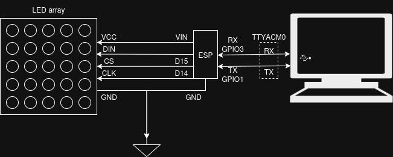

# Snake-on-ESP32
Develop Snake for the ESP32. Display is on 8x8 Dot Matrix LED (MAX7219 encoder)

## Repo Structure
```
├── CMakeLists.txt
├── main
│   ├── CMakeLists.txt
│   ├── snake.h
│   ├── snake.c                 Snake Game Logic
│   ├── max7219.h
│   ├── max7219.c               MAX7219 configuration and display logic
│   ├── uart_controller.h
│   └── uart_controller.c       UART controller (for now just using espidf monitor)
└── README.md                   This is the file you are currently reading
```

## Implementation

### Hardware
1. ESP32-WROOM
2. MAX7219 Dot Matrix (8x8)
3. Breadboard & some wires

**Platform**: ESP-IDF



### Video
[](https://youtu.be/eayOmCEmgiY)

## Potential Improvements
1. Control using Python Script. Was unable to make UART work with Python
2. Change Controller to Bluetooth or Wifi or JoyStick.
3. Implement a Snake Solver.
